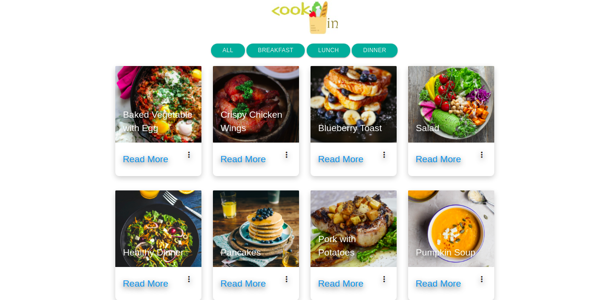

# Responsive Recipe page

This is a simple recipe page where I dynamically display products (recipe)
by getting local data and set up a filter buttons for each category using
Java Script.

## Framework

Materialize

```HTML
 <!-- Compiled and minified CSS -->
    <link rel="stylesheet" href="https://cdnjs.cloudflare.com/ajax/libs/materialize/1.0.0/css/materialize.min.css">

    <!-- Compiled and minified JavaScript -->
    <script src="https://cdnjs.cloudflare.com/ajax/libs/materialize/1.0.0/js/materialize.min.js"></script>

```


